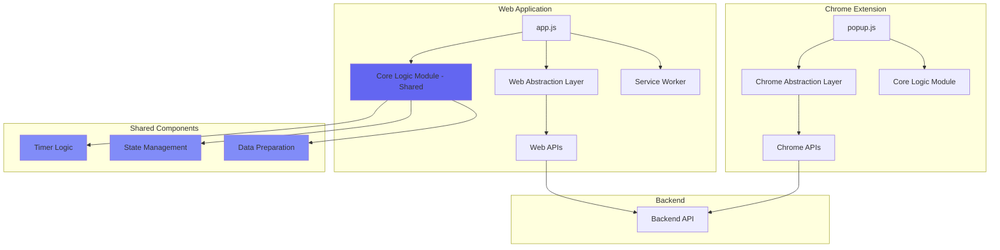

# Design Document

## Overview

This design outlines the architecture for porting the AuraFlow Chrome Extension to a standalone web application with Progressive Web App (PWA) capabilities. The solution follows a refactor-repackage-enhance strategy that maximizes code reuse while enabling cross-platform deployment.

The core approach involves:
1. **Refactoring** the existing Chrome extension to separate platform-agnostic logic from Chrome-specific APIs
2. **Creating** a platform abstraction layer that can be implemented for different environments
3. **Building** a new web application shell that reuses the core logic
4. **Enhancing** the web app with PWA features for offline functionality and mobile installation

## Architecture

### High-Level Architecture



### Module Structure

```
auraflow-extension/
├── core-logic.js              # Platform-agnostic logic (NEW)
├── chrome-platform-services.js # Chrome API wrappers (NEW)
├── popup.js                    # Chrome extension UI (REFACTORED)
├── popup.html                  # Chrome extension HTML
├── popup.css                   # Shared styles
└── background.js               # Chrome service worker

webapp/
├── index.html                  # Web app HTML (adapted from popup.html)
├── style.css                   # Web app styles (adapted from popup.css)
├── app.js                      # Web app main script
├── core-logic.js               # Copied from extension
├── web-platform-services.js    # Web API implementations
├── manifest.json               # PWA manifest
└── service-worker.js           # PWA service worker
```

## Components and Interfaces

### 1. Core Logic Module (`core-logic.js`)

**Purpose:** Contains all platform-agnostic application logic that can be shared between Chrome extension and web app.

**Exported Functions:**

```javascript
// Timer Management
export function startTimer(duration, onTick, onComplete)
export function pauseTimer()
export function resumeTimer()
export function stopTimer()
export function getTimerState()

// Session State Management
export function initializeSession(config)
export function updateSessionState(updates)
export function getSessionState()
export function switchMode(mode) // 'work' or 'break'

// Data Preparation for Backend
export function prepareSessionData(sessionInfo)
export function prepareFocusTimeRequest(events, preferences)
export function prepareRitualRequest(context)

// Validation and Utilities
export function validateSessionConfig(config)
export function formatTime(seconds)
export function calculateProgress(elapsed, total)
```

**Internal State:**
- Timer interval reference
- Current session configuration
- Elapsed time
- Session mode (work/break)
- Pause state

### 2. Platform Abstraction Layer

**Purpose:** Provides a consistent interface for platform-specific operations, allowing the same core logic to work with different underlying APIs.

**Interface Definition:**

```javascript
// Storage Operations
function saveData(key, value): Promise<void>
function getData(key): Promise<any>
function removeData(key): Promise<void>

// Notification Operations
function createNotification(options): Promise<void>
function requestNotificationPermission(): Promise<boolean>

// Audio Operations
function playSound(soundId, volume): Promise<void>
function stopSound(soundId): void
function setSoundVolume(soundId, volume): void

// Network Operations
function fetchFromBackend(endpoint, options): Promise<Response>
```

### 3. Chrome Platform Services (`chrome-platform-services.js`)

**Implementation:** Wraps Chrome-specific APIs to match the platform abstraction interface.

```javascript
export async function saveData(key, value) {
    return new Promise((resolve) => {
        chrome.storage.sync.set({ [key]: value }, resolve);
    });
}

export async function getData(key) {
    return new Promise((resolve) => {
        chrome.storage.sync.get(key, (result) => {
            resolve(result[key]);
        });
    });
}

export async function createNotification(options) {
    return new Promise((resolve) => {
        chrome.notifications.create({
            type: 'basic',
            iconUrl: options.iconUrl,
            title: options.title,
            message: options.message
        }, resolve);
    });
}

export async function fetchFromBackend(endpoint, options) {
    return fetch(endpoint, options);
}
```

### 4. Web Platform Services (`web-platform-services.js`)

**Implementation:** Uses standard web APIs to match the platform abstraction interface.

```javascript
export async function saveData(key, value) {
    localStorage.setItem(key, JSON.stringify(value));
}

export async function getData(key) {
    const data = localStorage.getItem(key);
    return data ? JSON.parse(data) : null;
}

export async function createNotification(options) {
    if ('Notification' in window && Notification.permission === 'granted') {
        new Notification(options.title, {
            body: options.message,
            icon: options.iconUrl,
            badge: options.iconUrl
        });
    }
}

export async function requestNotificationPermission() {
    if ('Notification' in window) {
        const permission = await Notification.requestPermission();
        return permission === 'granted';
    }
    return false;
}

export async function fetchFromBackend(endpoint, options) {
    return fetch(endpoint, options);
}
```

### 5. Web Application Main Script (`app.js`)

**Purpose:** Orchestrates the web application, connecting UI events to core logic through the web platform services.

**Structure:**

```javascript
import * as CoreLogic from './core-logic.js';
import * as Platform from './web-platform-services.js';

// Application state
let currentScreen = 'auth';
let sessionActive = false;

// Initialize application
async function init() {
    await checkAuthentication();
    setupEventListeners();
    registerServiceWorker();
    requestNotificationPermission();
}

// UI Event Handlers
function handleStartSession(config) {
    const session = CoreLogic.initializeSession(config);
    CoreLogic.startTimer(
        config.duration,
        (timeRemaining) => updateTimerDisplay(timeRemaining),
        () => handleSessionComplete()
    );
    showScreen('session');
}

// Service Worker Registration
async function registerServiceWorker() {
    if ('serviceWorker' in navigator) {
        try {
            await navigator.serviceWorker.register('/service-worker.js');
            console.log('Service Worker registered');
        } catch (error) {
            console.error('Service Worker registration failed:', error);
        }
    }
}
```

### 6. PWA Service Worker (`service-worker.js`)

**Purpose:** Enables offline functionality by caching essential app resources.

**Caching Strategy:**

```javascript
const CACHE_NAME = 'auraflow-v1';
const ASSETS_TO_CACHE = [
    '/',
    '/index.html',
    '/style.css',
    '/app.js',
    '/core-logic.js',
    '/web-platform-services.js',
    '/icons/icon-192.png',
    '/icons/icon-512.png',
    '/sounds/notification.mp3'
];

// Install event - cache assets
self.addEventListener('install', (event) => {
    event.waitUntil(
        caches.open(CACHE_NAME)
            .then((cache) => cache.addAll(ASSETS_TO_CACHE))
    );
});

// Fetch event - serve from cache, fallback to network
self.addEventListener('fetch', (event) => {
    event.respondWith(
        caches.match(event.request)
            .then((response) => response || fetch(event.request))
    );
});

// Activate event - clean up old caches
self.addEventListener('activate', (event) => {
    event.waitUntil(
        caches.keys().then((cacheNames) => {
            return Promise.all(
                cacheNames
                    .filter((name) => name !== CACHE_NAME)
                    .map((name) => caches.delete(name))
            );
        })
    );
});
```

### 7. PWA Manifest (`manifest.json`)

**Purpose:** Defines PWA metadata for installation and appearance.

```json
{
    "name": "AuraFlow - Focus Timer",
    "short_name": "AuraFlow",
    "description": "AI-powered focus timer with calendar integration",
    "start_url": "/index.html",
    "display": "standalone",
    "background_color": "#ffffff",
    "theme_color": "#6366f1",
    "orientation": "portrait-primary",
    "icons": [
        {
            "src": "/icons/icon-192.png",
            "sizes": "192x192",
            "type": "image/png",
            "purpose": "any maskable"
        },
        {
            "src": "/icons/icon-512.png",
            "sizes": "512x512",
            "type": "image/png",
            "purpose": "any maskable"
        }
    ],
    "categories": ["productivity", "utilities"],
    "screenshots": []
}
```

## Data Models

### Session Configuration

```javascript
{
    duration: 1500,              // seconds (25 minutes)
    mode: 'work',                // 'work' or 'break'
    soundscape: 'rain',          // audio theme
    volume: 50,                  // 0-100
    blockedSites: [],            // array of domain strings
    ritualName: 'Deep Work',     // optional
    autoStartBreak: true         // boolean
}
```

### Timer State

```javascript
{
    isRunning: false,
    isPaused: false,
    elapsed: 0,                  // seconds
    remaining: 1500,             // seconds
    startTime: null,             // timestamp
    pauseTime: null              // timestamp
}
```

### Session Data (for Backend)

```javascript
{
    sessionId: 'uuid',
    userId: 'user-id',
    startTime: '2025-10-02T10:00:00Z',
    endTime: '2025-10-02T10:25:00Z',
    duration: 1500,
    mode: 'work',
    completed: true,
    interruptions: 0,
    ritualUsed: 'Deep Work'
}
```

## Error Handling

### Error Categories

1. **Storage Errors**
   - Chrome extension: Handle `chrome.runtime.lastError`
   - Web app: Handle localStorage quota exceeded
   - Fallback: Use in-memory storage

2. **Network Errors**
   - Timeout handling (10s for events, 15s for AI features)
   - Retry logic with exponential backoff
   - Offline detection and graceful degradation

3. **Notification Errors**
   - Permission denied: Show in-app notifications
   - Not supported: Use visual indicators only

4. **Service Worker Errors**
   - Registration failure: Log but continue (app still works online)
   - Cache failure: Serve from network

### Error Handling Pattern

```javascript
async function safeOperation(operation, fallback) {
    try {
        return await operation();
    } catch (error) {
        console.error('Operation failed:', error);
        logError(error);
        return fallback ? fallback() : null;
    }
}

// Usage
const data = await safeOperation(
    () => Platform.getData('sessionConfig'),
    () => getDefaultConfig()
);
```

## Testing Strategy

### Unit Testing

**Core Logic Module:**
- Timer countdown accuracy
- State transitions (work/break, pause/resume)
- Data preparation functions
- Validation functions

**Platform Services:**
- Mock Chrome APIs for chrome-platform-services
- Mock localStorage for web-platform-services
- Verify interface compliance

### Integration Testing

**Chrome Extension:**
- Authentication flow
- Event fetching and display
- Session start/stop with storage
- Notification delivery

**Web Application:**
- Page load and initialization
- Service worker registration
- Offline functionality
- localStorage persistence

### End-to-End Testing

**Desktop Browser:**
- Complete user flow from auth to session completion
- Theme switching
- AI features integration
- Responsive layout at different viewport sizes

**Mobile Device:**
- PWA installation flow
- Standalone mode appearance
- Offline mode functionality
- Touch interactions
- Notification permissions

### Testing Checklist

1. **Functional Testing**
   - [ ] Timer counts down accurately
   - [ ] Work/break transitions work
   - [ ] Settings persist across sessions
   - [ ] Backend API calls succeed
   - [ ] Notifications appear correctly

2. **PWA Testing**
   - [ ] Manifest loads correctly
   - [ ] Service worker registers
   - [ ] App installs on mobile
   - [ ] Offline mode works
   - [ ] App icon appears on home screen

3. **Cross-Browser Testing**
   - [ ] Chrome/Edge (Chromium)
   - [ ] Firefox
   - [ ] Safari (iOS and macOS)

4. **Responsive Testing**
   - [ ] 320px width (small mobile)
   - [ ] 375px width (standard mobile)
   - [ ] 768px width (tablet)
   - [ ] 1024px+ width (desktop)

## Responsive Design Considerations

### Breakpoints

```css
/* Mobile-first approach */
:root {
    --app-width: 380px;
    --app-padding: 1rem;
}

/* Small mobile */
@media (max-width: 320px) {
    :root {
        --app-padding: 0.75rem;
    }
}

/* Tablet and up */
@media (min-width: 768px) {
    :root {
        --app-width: 600px;
        --app-padding: 2rem;
    }
}

/* Desktop */
@media (min-width: 1024px) {
    :root {
        --app-width: 800px;
        --app-padding: 3rem;
    }
}
```

### Layout Adaptations

- **Mobile (< 768px):** Single column, full-width buttons, compact spacing
- **Tablet (768px - 1023px):** Wider container, larger touch targets
- **Desktop (≥ 1024px):** Maximum width container, centered layout, hover states

## Security Considerations

1. **Data Storage**
   - No sensitive data in localStorage (tokens handled by backend)
   - Sanitize user input for blocked sites list
   - Validate all data before storage

2. **Content Security Policy**
   - Restrict script sources
   - Allow only necessary external resources
   - Prevent inline script execution

3. **API Communication**
   - Use HTTPS for all backend requests
   - Implement CORS properly
   - Validate response data

4. **Service Worker**
   - Cache only public assets
   - Don't cache authenticated API responses
   - Implement cache versioning

## Performance Optimization

1. **Asset Loading**
   - Minimize CSS/JS bundle sizes
   - Use font subsetting for custom fonts
   - Lazy load non-critical resources

2. **Caching Strategy**
   - Cache-first for static assets
   - Network-first for API calls
   - Stale-while-revalidate for semi-static content

3. **Runtime Performance**
   - Use requestAnimationFrame for timer updates
   - Debounce user input handlers
   - Minimize DOM manipulations

## Migration Path

### Phase 1: Refactor Extension
1. Create core-logic.js with extracted functions
2. Create chrome-platform-services.js
3. Refactor popup.js to use abstraction layer
4. Test extension still works

### Phase 2: Build Web App
1. Create webapp directory structure
2. Copy and adapt HTML/CSS
3. Implement web-platform-services.js
4. Create app.js with UI logic
5. Test basic functionality

### Phase 3: Add PWA Features
1. Create manifest.json
2. Implement service-worker.js
3. Add service worker registration
4. Test offline functionality
5. Test mobile installation

### Phase 4: Polish and Test
1. Responsive design refinements
2. Cross-browser testing
3. Performance optimization
4. Documentation
